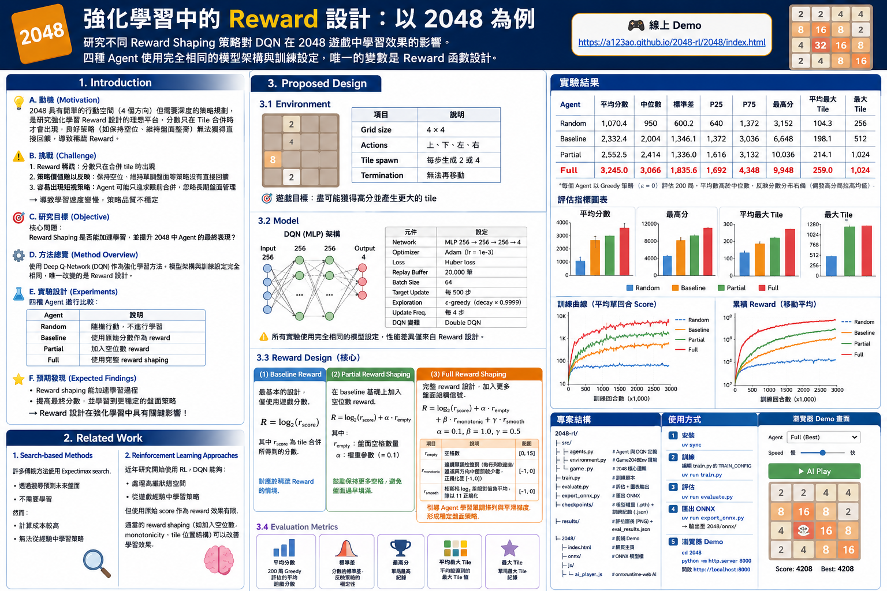
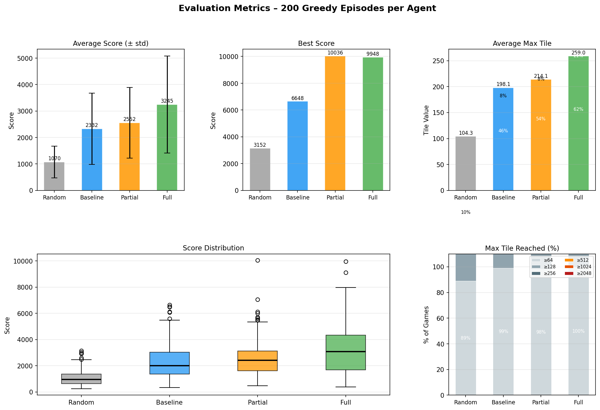
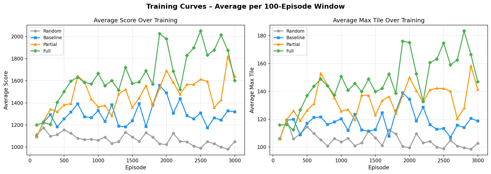
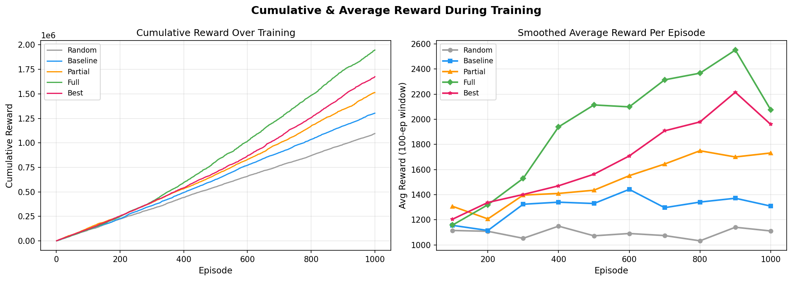

# 強化學習中的 Reward 設計：以 2048 為例

研究不同 Reward Shaping 策略對 DQN 在 2048 遊戲中學習效果的影響。
四種 Agent 使用完全相同的模型架構與訓練設定，唯一的變數是 **Reward 函數設計**。

🎮 **線上 Demo：[https://a123ao.github.io/2048-rl/2048/index.html](https://a123ao.github.io/2048-rl/2048/index.html)**

---

## 資訊圖表



---

## 實驗結果

| Agent    | 平均分數 | 中位數 | 標準差 | P25 | P75 | 最高分 | 平均最大 Tile | 最大 Tile |
|----------|--------:|-------:|-------:|----:|----:|-------:|-------------:|----------:|
| Random   |  1070.4 |    950 |  600.2 |  640 | 1372 |   3152 |        104.3 |       256 |
| Baseline |  2332.4 |  2,004 | 1346.1 | 1372 | 3036 |   6648 |        198.1 |       512 |
| Partial  |  2552.5 |  2,414 | 1336.0 | 1616 | 3132 |  10036 |        214.1 |      1024 |
| **Full** | **3245.0** | **3,066** | **1835.6** | **1692** | **4348** | **9948** | **259.0** | **1024** |

*每個 Agent 以 Greedy 策略（ε = 0）評估 200 局。平均數高於中位數，反映分數分布右偏（偶發高分局拉高均值）。*

### 評估指標圖表



### 訓練曲線



### 累積與平均 Reward



---

## 研究動機

2048 擁有簡單的行動空間（4 個方向）但需要深度的策略規劃，是研究強化學習 Reward 設計的理想平台。核心挑戰在於 **稀疏 Reward（Sparse Reward）**：分數只有在 Tile 合併時才會出現，因此「保持空位」、「維持盤面整齊」等良好策略無法獲得直接回饋。

**核心問題：**

> Reward Shaping 是否能加速學習，並提升 2048 中 Agent 的最終表現？

---

## 方法

### 環境設定

- 4×4 盤面，4 個行動（上 / 下 / 左 / 右）
- 每步在空格隨機生成數字 2 或 4
- 無合法移動時遊戲結束

### 狀態編碼

盤面狀態使用 One-hot 編碼：

$$s \in \mathbb{R}^{256} \quad \text{（16 格} \times \text{16 個 } \log_2 \text{ 值的 Bin）}$$

Tile 數值為類別型資料（2、4、8、…），One-hot 編碼比純量正規化能提供更豐富的資訊。

### 模型架構

所有 Agent 共用完全相同的架構，唯一變數為 Reward 函數：

| 元件 | 設定 |
|------|------|
| 網路架構 | MLP 256 → 256 → 256 → 4 |
| 優化器 | Adam（lr = 1e-3） |
| 損失函數 | Huber Loss |
| Replay Buffer | 20,000 筆 |
| Batch Size | 64 |
| Target Network 更新 | 每 500 步 |
| ε 衰減 | 每步 × 0.9999 |
| 網路更新頻率 | 每 4 步 |
| DQN 變體 | Double DQN |

---

## Reward 設計

### Random Agent（對照組）
每步隨機選擇合法移動，不進行任何學習。

### Baseline Agent
$$R = \log_2(r_{\text{score}})$$

只使用合併所得分數。對應稀疏 Reward 的情境，Agent 難以從中學習盤面策略。

### Partial Agent
$$R = \log_2(r_{\text{score}}) + \alpha \cdot r_{\text{empty}}$$

加入空格數作為額外 Reward（$\alpha = 0.1$），鼓勵 Agent 保持盤面空間以利後續合併。

### Full Agent（參考 Yiyuan Lee's Heuristic AI）
$$R = \log_2(r_{\text{score}}) + \alpha \cdot r_{\text{empty}} + \beta \cdot r_{\text{monotonic}} + \gamma \cdot r_{\text{smooth}}$$

$$\alpha = 0.1, \quad \beta = 1.0, \quad \gamma = 0.5$$

| 項目 | 說明 | 範圍 |
|------|------|------|
| $r_{\text{empty}}$ | 空格數 | [0, 15] |
| $r_{\text{monotonic}}$ | 連續單調性懲罰（每行列取遞增/遞減兩方向中懲罰較少者，正規化至 [-1, 0]） | [-1, 0] |
| $r_{\text{smooth}}$ | 相鄰格 log₂ 差絕對值負平均，除以 11 正規化 | [-1, 0] |

加入連續的盤面結構信號，引導 Agent 學習單調排列與平滑梯度，比二元 corner/monotonic 信號更細緻。

---

## 評估指標

| 指標 | 說明 |
|------|------|
| 平均分數 | 200 局 Greedy 評估的平均遊戲分數 |
| 標準差 | 分數的標準差，反映策略的穩定性 |
| 最高分 | 單局最高紀錄 |
| 平均最大 Tile | 平均能達到的最大 Tile 值 |
| 最大 Tile | 單局最大 Tile 紀錄 |

---

## 專案結構

```
2048-rl/
├── src/
│   ├── agents.py        # RandomAgent、BaselineAgent、PartialRewardAgent、
│   │                    # FullRewardAgent、DQNNetwork
│   ├── environment.py   # Game2048Env 環境封裝
│   └── game.py          # 2048 核心遊戲邏輯
├── train.py             # 訓練腳本（編輯 TRAIN_CONFIG 選擇要訓練的 Agent）
├── evaluate.py          # Greedy 評估 + 圖表輸出
├── export_onnx.py       # 將 Checkpoint 匯出為 ONNX
├── checkpoints/         # 模型權重（.pth）+ 訓練紀錄（.json）
├── results/             # 評估圖表（PNG）+ eval_results.json
└── 2048/                # 前端 Demo（原版遊戲 + AI 覆蓋層）
    ├── index.html
    ├── onnx/            # 自包含的 ONNX 模型，供瀏覽器直接推理
    └── js/
        └── ai_player.js # 使用 onnxruntime-web 執行的 DQN Agent
```

---

## 使用方式

### 安裝

```bash
uv sync
```

### 訓練

編輯 `train.py` 中的 `TRAIN_CONFIG`，選擇要訓練的 Agent：

```bash
uv run train.py
```

範例 — 同時訓練 Partial 與 Full Agent：

```python
TRAIN_CONFIG = [
    {"agent_type": "partial", "num_episodes": 3000, "epsilon_decay": 0.9999, "empty_weight": 0.1},
    {"agent_type": "full",    "num_episodes": 3000, "epsilon_decay": 0.9999, "empty_weight": 0.1, "monotonic_weight": 1.0, "smooth_weight": 0.5},
]
```

### 評估

```bash
uv run evaluate.py
```

輸出 `results/training_curves.png`、`results/cumulative_rewards.png`、`results/evaluation_metrics.png` 及 `results/eval_results.json`。

### 匯出 ONNX

```bash
uv run export_onnx.py
```

輸出至 `2048/onnx/{baseline,partial,full}_agent.onnx`。

### 瀏覽器 Demo

```bash
cd 2048
python -m http.server 8000
# 開啟 http://localhost:8000
```

從下拉選單選擇 Agent，調整速度滑桿，點擊 **▶ AI Play** 即可觀看 AI 對戰。
